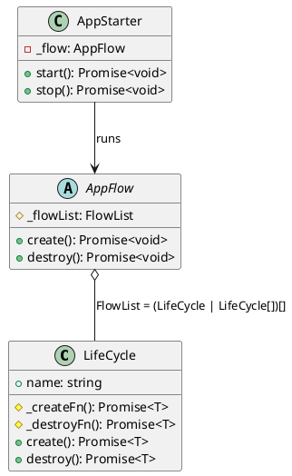

[](https://beecode.semaphoreci.com/projects/msh-app-boot)
[](https://codecov.io/gh/beecode-rs/msh-app-boot)
[](https://github.com/beecode-rs/msh-app-boot/blob/main/LICENSE)  
[](https://nodei.co/npm/@beecode/msh-app-boot)

# @beecode/msh-app-boot

> Micro-service helper: app initializer

A TypeScript helper for application initialization and shutdown. Compose your app from self-contained lifecycle units, declare the order they start (and the reverse order they stop), and let `AppStarter` wire up graceful shutdown on `SIGTERM`/`SIGINT`.

Built on three small primitives — `LifeCycle`, `AppFlow`, and `AppStarter` — and uses [`@beecode/msh-logger`](https://www.npmjs.com/package/@beecode/msh-logger) for logging.

<!-- toc -->

- [@beecode/msh-app-boot](#beecodemsh-app-boot)
	- [Install](#install)
	- [Quick Start](#quick-start)
	- [Architecture](#architecture)
		- [Concepts](#concepts)
		- [Project Structure](#project-structure)
	- [Logging](#logging)
	- [Usage](#usage)
		- [Basic Example](#basic-example)
	- [API Reference](#api-reference)
	- [License](#license)

<!-- tocstop -->

## Install

```bash
npm i @beecode/msh-app-boot
```

## Quick Start

Define a lifecycle unit, group your units in an `AppFlow`, and start it with `AppStarter`:

```typescript
import { AppFlow, AppStarter, LifeCycle, setAppBootLogger } from '@beecode/msh-app-boot'
import { LogLevel } from '@beecode/msh-logger'
import { PresetConsoleSimpleString } from '@beecode/msh-logger/controller/preset/console-simple-string'

class MyService extends LifeCycle {
  constructor() {
    super({ name: 'My service' })
  }

  protected async _createFn(): Promise<void> {
    console.log('starting...') // eslint-disable-line no-console
  }

  protected async _destroyFn(): Promise<void> {
    console.log('stopping...') // eslint-disable-line no-console
  }
}

class App extends AppFlow {
  constructor() {
    super(new MyService())
  }
}

setAppBootLogger(new PresetConsoleSimpleString({ logLevel: LogLevel.DEBUG }))
new AppStarter(new App()).start().catch((err) => console.error(err)) // eslint-disable-line no-console
```

## Architecture

### Concepts

App-boot is built on three composable primitives:

- **`LifeCycle`** — the atomic unit of initialization. Subclass it and implement the abstract `_createFn()` and `_destroyFn()` methods. App-boot wraps each call with `DEBUG` log lines (`<name> Create START` / `… END`, and the same for `Destroy`).
- **`AppFlow`** — the orchestrator. You pass it a `FlowList` — a list where each entry is either a single `LifeCycle` (run on its own) or an array of `LifeCycle`s (run together). On `create()` the list is executed **in order**: each top-level entry is awaited before the next, while the items inside an array entry run **in parallel** (`Promise.all`) and are all awaited before moving on. On `destroy()` the same logic runs against `_destroyFn`, but the **top-level** list is reversed first — so dependencies that started last stop first.
- **`AppStarter`** — the runner. `start()` calls `AppFlow.create()` and registers `SIGTERM`/`SIGINT` handlers that trigger a graceful `stop()` (which calls `destroy()`) before exiting. If `create()` throws, the error is logged, the app is stopped, and the process exits with code `1`.



### Project Structure

```
src/
├── business/service/
│   ├── life-cycle.ts        # LifeCycle (abstract) — init/destroy unit
│   └── app-flow.ts          # AppFlow, FlowList, FlowDirectionMapper
├── controller/
│   └── app-starter.ts       # AppStarter, AppStarterStatusMapper
└── util/
    └── logger.ts            # setAppBootLogger — inject an msh-logger strategy
```

## Logging

App-boot logs at `DEBUG` around every create/destroy call and at `ERROR`/`WARN` on startup and shutdown events. It depends on `@beecode/msh-logger`, and **defaults to a no-op logger** (`PresetVoid`) — so by default nothing is printed.

To see logs, inject a logger strategy with `setAppBootLogger` before starting the app:

```typescript
import { setAppBootLogger } from '@beecode/msh-app-boot'
import { LogLevel } from '@beecode/msh-logger'
import { PresetConsoleSimpleString } from '@beecode/msh-logger/controller/preset/console-simple-string'

setAppBootLogger(new PresetConsoleSimpleString({ logLevel: LogLevel.DEBUG }))
```

Any `LoggerStrategy` from `@beecode/msh-logger` works (e.g. `PresetConsoleJson`, `PresetPino`). See the [msh-logger README](https://github.com/beecode-rs/msh-logger#readme) for the full list.

## Usage

### Basic Example

`FirstInitiable` runs first; once it finishes, `SecondInitiable` and `ThirdInitiable` run **in parallel**. (Full source at `./test/src/basic-example/`.)

```typescript
// initiate/first-initiable.ts
import { LifeCycle } from '@beecode/msh-app-boot'

export class FirstInitiable extends LifeCycle {
  constructor() {
    super({ name: 'First initiable' })
  }

  protected async _createFn(): Promise<void> {
    console.log('%%%%%% First create')
  }

  protected async _destroyFn(): Promise<void> {
    console.log('%%%%%% First destroy')
  }
}

// SecondInitiable and ThirdInitiable are identical, just with their own names.
```

```typescript
// app.ts
import { AppFlow } from '@beecode/msh-app-boot'
import { FirstInitiable } from './initiate/first-initiable'
import { SecondInitiable } from './initiate/second-initiable'
import { ThirdInitiable } from './initiate/third-initiable'

export class App extends AppFlow {
  constructor() {
    super(new FirstInitiable(), [new SecondInitiable(), new ThirdInitiable()])
  }
}
```

```typescript
// index.ts
import { AppStarter, setAppBootLogger } from '@beecode/msh-app-boot'
import { LogLevel } from '@beecode/msh-logger'
import { PresetConsoleSimpleString } from '@beecode/msh-logger/controller/preset/console-simple-string'
import { App } from './app'

setAppBootLogger(new PresetConsoleSimpleString({ logLevel: LogLevel.DEBUG }))

new AppStarter(new App()).start().catch((err) => console.error(err))
```

Running it (`npx ts-node ./index.ts`):

```
2026-06-30T12:00:00.000Z - DEBUG: First initiable Create START
%%%%%% First create
2026-06-30T12:00:00.001Z - DEBUG: First initiable Create END
2026-06-30T12:00:00.001Z - DEBUG: Second initiable Create START
%%%%%% Second create
2026-06-30T12:00:00.002Z - DEBUG: Third initiable Create START
%%%%%% Third create
2026-06-30T12:00:00.002Z - DEBUG: Second initiable Create END
2026-06-30T12:00:00.003Z - DEBUG: Third initiable Create END
```

> `SecondInitiable` and `ThirdInitiable` run concurrently, so their lines may interleave differently between runs.

## API Reference

Full API documentation is generated with TypeDoc and available in `resource/doc/api/`.

**Public exports** (from `@beecode/msh-app-boot`):

| Export | Kind | Description |
|--------|------|-------------|
| `LifeCycle` | abstract class | Base for an init/destroy unit — implement `_createFn()` and `_destroyFn()` |
| `AppFlow` | abstract class | Orchestrates a `FlowList` of `LifeCycle`s in create order, reversed on destroy |
| `FlowList` | type | `(LifeCycle \| LifeCycle[])[]` — a single unit runs alone; an array entry runs in parallel |
| `FlowDirectionMapper` | enum | `CREATE` / `DESTROY` |
| `AppStarter` | class | Runs an `AppFlow` and handles graceful shutdown on `SIGTERM`/`SIGINT` |
| `AppStarterStatusMapper` | enum | `STARTED` / `STOPPED` |
| `setAppBootLogger` | function | Inject a `LoggerStrategy` from `@beecode/msh-logger` |

## License

[MIT](LICENSE)
